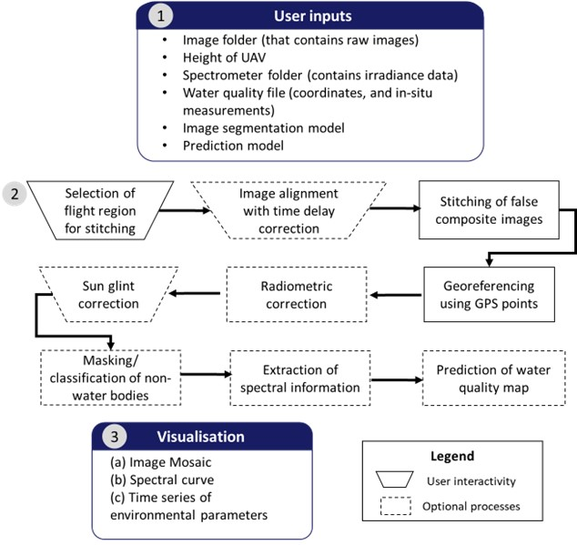

[]

**Author**: Pak Hui Ying  
**E-mail**: pakhuiying95[at]gmail[dot]com

# CoastalWQL
CoastalWQL is an open-source software tailored for UAV-based water quality monitoring with a pushbroom hyperspectral imager. It performs the following workflow:

* Interactive selection of regions for image stitching
* Interactive image alignment with real-time *time delay correction*
* Producing false-composite images from different hyperspectral bands (default is rgb)
* Sun glint correction using Hedley et al's algorithm (To be updated with SUGAR algorithm to avoid over-correction in turbid/shallow regions)
* Radiometric calibration and correction
* Image registration
* Image segmentation and masking (for masking out non-water objects)
* Extraction of spectral information based on supplied water quality information (e.g. coordinates, in-situ measurements)
* Prediction of water quality map
* Extraction of weather variables (wind-speed, wind-direction, air-temperature, relative humidity) (only applicable for retrieving from Singapore's weather stations for now)

*Source*: Pak et al (2023) An open-source tool for drone-based mapping of coastal water quality using push broom hyperspectral imagery (under review in *Remote Sensing*)

# Dependencies
* `python == 3.6`
* conda
    * `gdal == 3.0.2`
    * `py-xgboost == 0.90`
    * `rasterio == 1.1.0`
* pip
    * numpy
    * pandas
    * matplotlib
    * sklearn
    * scipy
    * OpenCV
    * `pysimplegui == 4.55.1`

# Usage

* Download [anaconda](https://www.anaconda.com/) (optional but recommended)
* Clone or download this repository into your preferred directory
* Create a virtual environment using `conda env create -f env.yml` (*recommended*) OR `pip install -r CoastalWQL_requirements.txt`
* In your preferred IDE, run `GUI_platform.py`
* For testing image segmentation and masking, users can supply their own model or try out using the supplied segmentation model `xgb_segmentation.json`
* For testing model prediction, users may supply their own model or try out the models in the *turbidity_prediction* folder
* Alternatively, run the code in the python notebook `CoastalWQL_nb.ipynb`
* Example inputs are provided but hyperspectral images and spectrometer not shared on github due to the sheer size of the data (~70-80GB of images).
* Example images and spectrometer data acquired from Nanyang Lake in Nanyang Technological University are shared [here](https://drive.google.com/drive/folders/1sQl46ogE3xtTtfrL_iqUmq_j5pbkNlaK?usp=sharing)

*For more details on CoastalWQL's features, do read* `Descriptions of features.pdf`. For a video demonstration, click [here](https://youtu.be/Jf2hCieibZ8)

## TO-DOs

CoastalWQL is still in development, additional branches added for updates/development

- Atmospheric correction
- Integration with SUGAR: sun-glint correction algorithm for turbid/shallow regions

