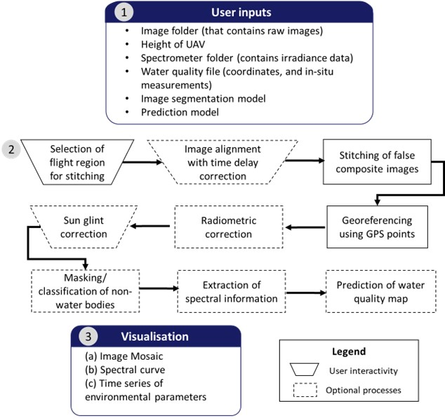

# CoastalWQL
CoastalWQL is an open-source software tailored for UAV-based water quality monitoring with a pushbroom hyperspectral imager. It performs the following workflow:

* Interactive selection of regions
* Interactive image alignment with time delay correction
* Producing false-composite images
* Sun glint correction
* Radiometric correction
* Image registration
* Image segmentation and masking
* Extraction of spectral information based on supplied water quality information
* Prediction of water quality map

*Source*: Pak et al (2022) An open-source CoastalWQL software for stitching, pre-processing and visualization of push-broom hyperspectral imagery for UAV-based coastal water quality monitoring (to be submitted)

# Dependencies
* `python == 3.6`
* conda
    * `gdal == 3.0.2`
    * `py-xgboost == 0.90`
    * `rasterio == 1.1.0`
* pip
    * numpy
    * pandas
    * matplotlib
    * sklearn
    * scipy
    * OpenCV
    * `pysimplegui == 4.55.1`

# Usage

* Download [anaconda](https://www.anaconda.com/) (optional but recommended)
* Clone or download this repository into your preferred directory
* Create a virtual environment using `conda env create --file CoastalWQL-env.txt` and `pip install -r CoastalWQL_requirements.txt`
* In your preferred IDE, run `GUI_platform.py`
* For testing image segmentation and masking, users can supply their own model or try out using the supplied segmentation model `xgb_segmentation.json`
* For testing model prediction, users may supply their own model or try out the models in the *turbidity_prediction* folder
* Alternatively, run the code in the python notebook `CoastalWQL_nb.ipynb`
* Example inputs are provided but hyperspectral images and spectrometer not shared on github due to the sheer size of the data (~70-80GB of images).
* Example images and spectrometer data acquired in Nanyang Lake, Nanyang Technological University are shared [here](https://drive.google.com/drive/folders/1sQl46ogE3xtTtfrL_iqUmq_j5pbkNlaK?usp=sharing)

*For more details on CoastalWQL's features, do read* `Descriptions of features.pdf`. For a video demonstration, click [here](https://youtu.be/Jf2hCieibZ8)

